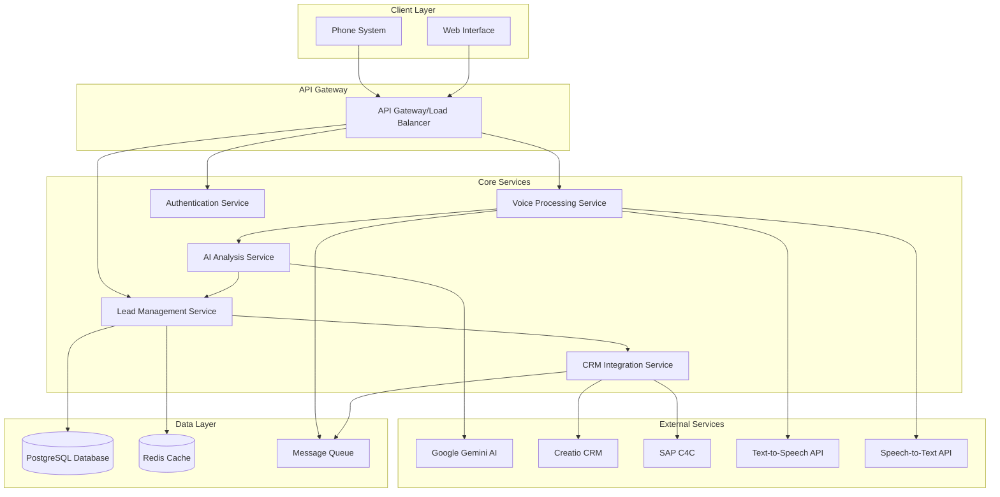

# NIA (Neural Intelligence Assistant) - Design Document

## Overview

NIA is a cloud-based AI sales assistant that combines voice interaction, natural language processing, and CRM integration to help sales teams manage leads and opportunities more effectively. The system uses a microservices architecture with real-time voice processing, AI-powered analysis using Google's Gemini AI, and bidirectional CRM synchronization.

## Architecture

### High-Level Architecture



### Technology Stack

- **Backend**: Python Django with Django REST Framework (microservices)
- **Database**: PostgreSQL for persistent data, Redis for caching
- **Voice Processing**: Google Cloud Speech-to-Text and Text-to-Speech APIs
- **AI Processing**: Google Gemini AI API with Python SDK
- **Message Queue**: Celery with Redis for background job processing
- **Authentication**: Django JWT with OAuth2 for CRM integrations
- **Frontend Options**:
  - **Recommended**: Angular 17+ with Angular Material (for complex enterprise features)
  - **Alternative**: Vanilla HTML/CSS/JavaScript with modern ES6+ (for simpler, faster development)
- **API Communication**: Django REST Framework with OpenAPI documentation
- **Deployment**: Docker containers with Kubernetes orchestration

### Frontend Technology Recommendation

**Option 1: Angular 17+ (Recommended for Enterprise)**
- **Pros**: 
  - Excellent for complex enterprise applications
  - Built-in TypeScript support
  - Angular Material for consistent UI components
  - Strong routing and state management
  - Great for real-time features with WebSocket support
  - Excellent testing framework
- **Cons**: 
  - Steeper learning curve
  - Larger bundle size
  - More complex setup

**Option 2: Vanilla HTML/CSS/JavaScript (Recommended for Speed)**
- **Pros**: 
  - Faster development and deployment
  - Smaller bundle size and better performance
  - Easier to maintain and debug
  - Direct integration with Django templates if needed
  - Modern ES6+ features provide good functionality
- **Cons**: 
  - More manual work for complex UI interactions
  - Less structured for large applications
  - Manual state management

**Recommendation**: Start with **Angular** for the enterprise features and scalability, but if development speed is critical, vanilla JavaScript with modern frameworks like Alpine.js or Stimulus (Django-friendly) could be considered.

## Components and Interfaces

### 1. Voice Processing Service

**Purpose**: Handles voice calls, speech-to-text conversion, and text-to-speech responses.

**Key Functions**:
- Accept incoming voice calls via WebRTC or SIP integration
- Convert speech to text using Google Cloud Speech-to-Text API
- Generate natural voice responses using Google Cloud Text-to-Speech
- Maintain conversation context and session state

**Django Service Interface**:
```python
# voice_service/models.py
class CallSession(models.Model):
    session_id = models.UUIDField(primary_key=True, default=uuid.uuid4)
    user = models.ForeignKey(User, on_delete=models.CASCADE)
    start_time = models.DateTimeField(auto_now_add=True)
    end_time = models.DateTimeField(null=True, blank=True)
    status = models.CharField(max_length=20, default='active')

# voice_service/services.py
class VoiceProcessingService:
    def initiate_call(self, user_id: str) -> CallSession:
        """Initialize a new voice call session"""
        
    def process_audio_stream(self, session_id: str, audio_data: bytes) -> dict:
        """Process incoming audio and return transcription"""
        
    def generate_speech_response(self, text: str, voice_config: dict) -> bytes:
        """Generate audio response using TTS"""
        
    def end_call(self, session_id: str) -> dict:
        """End call and return summary"""
```

### 2. AI Analysis Service

**Purpose**: Processes conversation data using Gemini AI to extract insights and generate recommendations.

**Key Functions**:
- Analyze conversation transcripts for lead information extraction
- Generate sales recommendations and next steps
- Assess lead quality and conversion probability
- Provide industry-specific insights and best practices

**Django Service Interface**:
```python
# ai_service/services.py
class AIAnalysisService:
    def __init__(self):
        self.gemini_client = genai.GenerativeModel('gemini-pro')
        
    def extract_lead_info(self, transcript: str) -> dict:
        """Extract structured lead information from conversation transcript"""
        
    def generate_recommendations(self, lead_data: dict, context: dict) -> list:
        """Generate AI-powered sales recommendations"""
        
    def assess_lead_quality(self, lead_data: dict) -> dict:
        """Assess lead quality and conversion probability"""
        
    def suggest_opportunity_conversion(self, lead_data: dict) -> dict:
        """Suggest when and how to convert lead to opportunity"""

# ai_service/models.py
class LeadInformation(models.Model):
    company_name = models.CharField(max_length=255)
    contact_details = models.JSONField()
    pain_points = models.JSONField(default=list)
    requirements = models.JSONField(default=list)
    budget_info = models.JSONField(null=True, blank=True)
    timeline = models.CharField(max_length=255, blank=True)
    decision_makers = models.JSONField(default=list)
```

### 3. CRM Integration Service

**Purpose**: Manages bidirectional synchronization with multiple CRM systems.

**Key Functions**:
- Authenticate with CRM systems using OAuth2/API keys
- Sync leads, contacts, and opportunities
- Create and update CRM records
- Handle CRM-specific data mapping and transformation

**Django Service Interface**:
```python
# crm_service/services.py
class CRMIntegrationService:
    def connect_crm(self, crm_type: str, credentials: dict) -> 'CRMConnection':
        """Establish connection to CRM system"""
        
    def sync_leads(self, crm_connection: 'CRMConnection') -> list:
        """Sync leads from CRM system"""
        
    def create_lead(self, crm_connection: 'CRMConnection', lead_data: dict) -> str:
        """Create new lead in CRM system"""
        
    def update_opportunity(self, crm_connection: 'CRMConnection', opportunity_data: dict):
        """Update opportunity in CRM system"""
        
    def log_activity(self, crm_connection: 'CRMConnection', activity_data: dict):
        """Log activity in CRM system"""

# crm_service/models.py
class CRMType(models.TextChoices):
    CREATIO = 'creatio', 'Creatio'
    SAP_C4C = 'sap_c4c', 'SAP C4C'

class CRMConnection(models.Model):
    user = models.ForeignKey(User, on_delete=models.CASCADE)
    crm_type = models.CharField(max_length=20, choices=CRMType.choices)
    credentials = models.JSONField()
    is_active = models.BooleanField(default=True)
    created_at = models.DateTimeField(auto_now_add=True)
```

### 4. Lead Management Service

**Purpose**: Central service for managing lead data, conversation history, and user interactions.

**Key Functions**:
- Store and retrieve lead information
- Manage conversation history and context
- Coordinate between AI analysis and CRM integration
- Provide unified lead view across multiple CRMs

**Interfaces**:
```typescript
interface LeadManagementService {
  createLead(leadData: LeadInformation, userId: string): Promise<Lead>
  updateLead(leadId: string, updates: Partial<LeadInformation>): Promise<Lead>
  getLeadsByUser(userId: string): Promise<Lead[]>
  addConversationHistory(leadId: string, conversation: ConversationTurn[]): Promise<void>
  getLeadInsights(leadId: string): Promise<AIInsights>
}
```

## Data Models

### Django Data Models

```python
# shared_models/models.py
from django.contrib.auth.models import AbstractUser
from django.db import models
import uuid

class User(AbstractUser):
    id = models.UUIDField(primary_key=True, default=uuid.uuid4)
    role = models.CharField(max_length=50, default='sales_rep')
    preferences = models.JSONField(default=dict)
    created_at = models.DateTimeField(auto_now_add=True)
    updated_at = models.DateTimeField(auto_now=True)

class Lead(models.Model):
    class Status(models.TextChoices):
        NEW = 'new', 'New'
        CONTACTED = 'contacted', 'Contacted'
        QUALIFIED = 'qualified', 'Qualified'
        CONVERTED = 'converted', 'Converted'
        LOST = 'lost', 'Lost'
    
    id = models.UUIDField(primary_key=True, default=uuid.uuid4)
    user = models.ForeignKey(User, on_delete=models.CASCADE)
    company_name = models.CharField(max_length=255)
    contact_info = models.JSONField()
    status = models.CharField(max_length=20, choices=Status.choices, default=Status.NEW)
    source = models.CharField(max_length=100, blank=True)
    pain_points = models.JSONField(default=list)
    requirements = models.JSONField(default=list)
    crm_record_id = models.CharField(max_length=255, blank=True)
    crm_system = models.CharField(max_length=20, blank=True)
    created_at = models.DateTimeField(auto_now_add=True)
    updated_at = models.DateTimeField(auto_now=True)

class ConversationTurn(models.Model):
    class Speaker(models.TextChoices):
        USER = 'user', 'User'
        NIA = 'nia', 'NIA'
    
    id = models.UUIDField(primary_key=True, default=uuid.uuid4)
    session_id = models.UUIDField()
    lead = models.ForeignKey(Lead, on_delete=models.CASCADE, related_name='conversation_history')
    timestamp = models.DateTimeField(auto_now_add=True)
    speaker = models.CharField(max_length=10, choices=Speaker.choices)
    content = models.TextField()
    audio_url = models.URLField(blank=True)
    extracted_entities = models.JSONField(default=dict)

class AIInsights(models.Model):
    lead = models.OneToOneField(Lead, on_delete=models.CASCADE, related_name='ai_insights')
    lead_score = models.FloatField(default=0.0)
    conversion_probability = models.FloatField(default=0.0)
    recommended_actions = models.JSONField(default=list)
    next_steps = models.JSONField(default=list)
    risk_factors = models.JSONField(default=list)
    opportunities = models.JSONField(default=list)
    last_analyzed = models.DateTimeField(auto_now=True)

class Opportunity(models.Model):
    class Stage(models.TextChoices):
        PROSPECTING = 'prospecting', 'Prospecting'
        QUALIFICATION = 'qualification', 'Qualification'
        PROPOSAL = 'proposal', 'Proposal'
        NEGOTIATION = 'negotiation', 'Negotiation'
        CLOSED_WON = 'closed_won', 'Closed Won'
        CLOSED_LOST = 'closed_lost', 'Closed Lost'
    
    id = models.UUIDField(primary_key=True, default=uuid.uuid4)
    lead = models.ForeignKey(Lead, on_delete=models.CASCADE)
    name = models.CharField(max_length=255)
    value = models.DecimalField(max_digits=12, decimal_places=2)
    probability = models.FloatField()
    stage = models.CharField(max_length=20, choices=Stage.choices)
    expected_close_date = models.DateField()
    crm_record_id = models.CharField(max_length=255, blank=True)
    crm_system = models.CharField(max_length=20, blank=True)
    created_at = models.DateTimeField(auto_now_add=True)
    updated_at = models.DateTimeField(auto_now=True)
```

### Database Schema

```sql
-- Users table
CREATE TABLE users (
  id UUID PRIMARY KEY DEFAULT gen_random_uuid(),
  email VARCHAR(255) UNIQUE NOT NULL,
  name VARCHAR(255) NOT NULL,
  role VARCHAR(50) NOT NULL,
  preferences JSONB,
  created_at TIMESTAMP DEFAULT NOW(),
  updated_at TIMESTAMP DEFAULT NOW()
);

-- CRM connections table
CREATE TABLE crm_connections (
  id UUID PRIMARY KEY DEFAULT gen_random_uuid(),
  user_id UUID REFERENCES users(id),
  crm_type VARCHAR(50) NOT NULL,
  credentials JSONB NOT NULL,
  is_active BOOLEAN DEFAULT true,
  created_at TIMESTAMP DEFAULT NOW()
);

-- Leads table
CREATE TABLE leads (
  id UUID PRIMARY KEY DEFAULT gen_random_uuid(),
  user_id UUID REFERENCES users(id),
  company_name VARCHAR(255) NOT NULL,
  contact_info JSONB NOT NULL,
  status VARCHAR(50) NOT NULL,
  source VARCHAR(100),
  pain_points TEXT[],
  requirements TEXT[],
  ai_insights JSONB,
  crm_record_id VARCHAR(255),
  crm_system VARCHAR(50),
  created_at TIMESTAMP DEFAULT NOW(),
  updated_at TIMESTAMP DEFAULT NOW()
);

-- Conversation history table
CREATE TABLE conversation_turns (
  id UUID PRIMARY KEY DEFAULT gen_random_uuid(),
  session_id UUID NOT NULL,
  lead_id UUID REFERENCES leads(id),
  timestamp TIMESTAMP DEFAULT NOW(),
  speaker VARCHAR(10) NOT NULL,
  content TEXT NOT NULL,
  audio_url VARCHAR(500),
  extracted_entities JSONB
);
```

## Error Handling

### Error Categories

1. **Voice Processing Errors**
   - Audio quality issues
   - Speech recognition failures
   - Network connectivity problems

2. **AI Processing Errors**
   - Gemini API rate limits
   - Invalid API responses
   - Context understanding failures

3. **CRM Integration Errors**
   - Authentication failures
   - API rate limits
   - Data synchronization conflicts
   - Network timeouts

4. **System Errors**
   - Database connection issues
   - Service unavailability
   - Memory/resource constraints

### Error Handling Strategy

```typescript
interface ErrorHandler {
  handleVoiceError(error: VoiceError, session: CallSession): Promise<ErrorResponse>
  handleAIError(error: AIError, context: ProcessingContext): Promise<ErrorResponse>
  handleCRMError(error: CRMError, operation: CRMOperation): Promise<ErrorResponse>
  handleSystemError(error: SystemError): Promise<ErrorResponse>
}

class ErrorResponse {
  code: string
  message: string
  userMessage: string
  retryable: boolean
  retryAfter?: number
  fallbackAction?: string
}
```

### Retry and Fallback Mechanisms

- **Exponential backoff** for API calls
- **Circuit breaker pattern** for external service calls
- **Graceful degradation** when AI services are unavailable
- **Offline queue** for CRM updates during outages
- **User notification system** for critical errors

## Testing Strategy

### Unit Testing
- Service layer testing with mocked dependencies
- Data model validation testing
- Utility function testing
- Error handling scenario testing

### Integration Testing
- CRM API integration testing with sandbox environments
- Voice processing pipeline testing
- AI service integration testing
- Database operation testing

### End-to-End Testing
- Complete voice call simulation
- Lead creation and CRM synchronization flow
- Multi-user scenario testing
- Performance and load testing

### Testing Tools
- **pytest** with Django test framework for unit and integration testing
- **Django REST Framework test client** for API endpoint testing
- **Selenium** for UI automation testing (if using Angular)
- **Locust** for load testing
- **Docker Compose** for test environment setup
- **Factory Boy** for test data generation

### Test Data Management
- Synthetic test data generation
- CRM sandbox environment setup
- Voice recording samples for testing
- Automated test data cleanup

### Performance Testing
- Voice processing latency testing
- AI response time optimization
- CRM synchronization performance
- Concurrent user load testing
- Memory usage and resource optimization